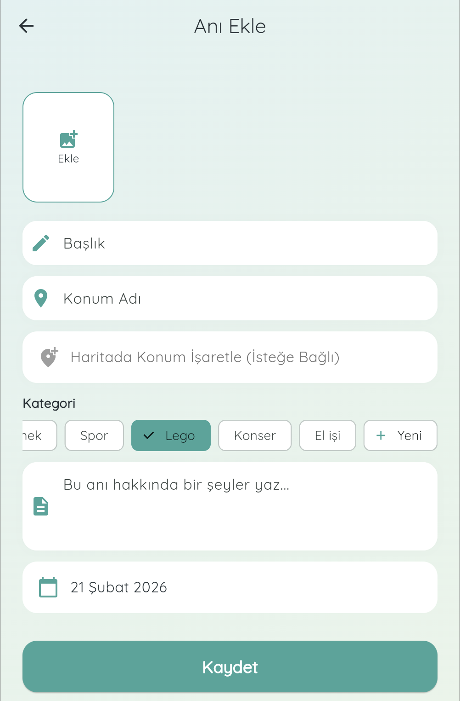
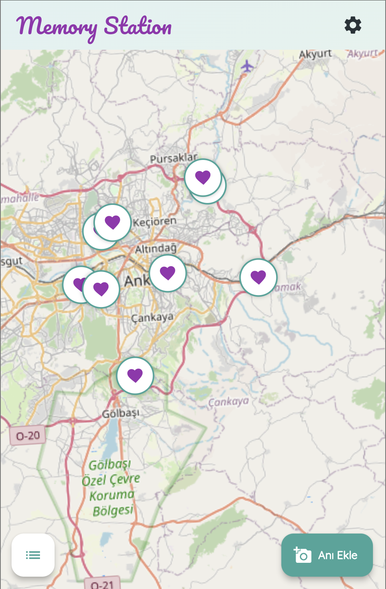
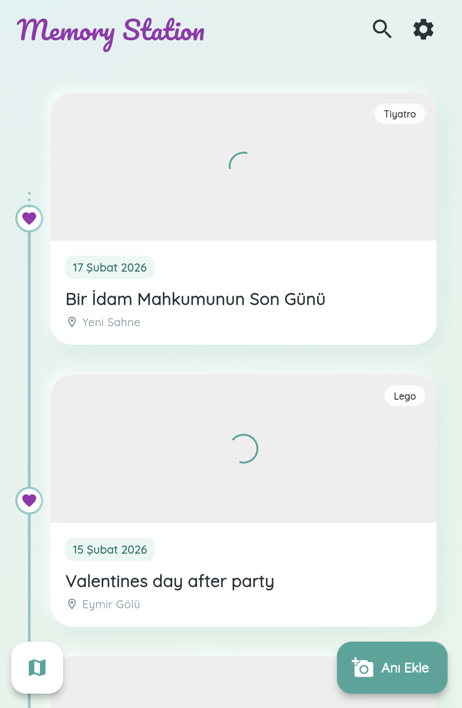

# Memory Station

**Memory Station**, çiftlerin en güzel anılarını dijital bir zaman çizelgesinde saklamasını sağlayan, Flutter ile geliştirilmiş özel bir mobil uygulamadır.

Bu proje, anıları fotoğraflar, konum bilgileri ve özel notlarla ölümsüzleştirir.

## Özellikler

* ** Zaman Çizelgesi (Timeline):** Tüm anılarınızı tarih sırasına göre şık bir akışta görüntüleyin.
* ** Çoklu Fotoğraf Desteği:** Her anıya 5 adede kadar fotoğraf ekleyin.
* ** Dinamik Kategoriler:** Anılarınızı (Sinema, Gezi, Yemek vb.) kategorilere ayırın ve yeni kategoriler oluşturun.
* ** Gelişmiş Filtreleme:** Tarih aralığına ve kategorilere göre anılarınızı filtreleyin.
* ** Özel Tasarım:** Yumuşak gradyanlar, özel fontlar ve "Soft UI" gölgelendirmelerle modern bir arayüz.
* ** Harita Görünümü:** OSM implementasyonu sayesinde tüm anı kartlarını dünya haritasında görüntüleyin.
* ** Bulut Tabanlı:** Veriler Firebase Firestore üzerinde güvenle saklanır (Fotoğraflar Base64 formatında optimize edilerek tutulur).

## Kullanılan Teknolojiler

* **[Flutter](https://flutter.dev/):** UI Geliştirme Kiti
* **[Firebase Firestore](https://firebase.google.com/docs/firestore):** NoSQL Veritabanı
* **Dart:** Programlama Dili

### Kütüphaneler
* `timeline_tile`: Zaman çizelgesi görünümü için.
* `image_picker`: Galeriden fotoğraf seçimi için.
* `google_fonts`: Özel yazı tipleri için.
* `intl`: Tarih formatlama için.
* `audioplayers`

## Ekran Görüntüleri
<p align="center">
  
  
  
</p>

## Kurulum

Bu projeyi kendi bilgisayarınızda çalıştırmak için:

1.  Repoyu klonlayın:
    ```bash
    git clone [[https://github.com/efeegrkm/memory-station.git](https://github.com/efeegrkm/memory-station.git)](https://github.com/efeegrkm/Memory-Station.git)
    ```
2.  Proje dizinine gidin:
    ```bash
    cd memory-station
    ```
3.  Paketleri yükleyin:
    ```bash
    flutter pub get
    ```
4.  Firebase veritabanı ayarlarını yapılandırın (kendi `firebase_options.dart` dosyanızı firebase console kullanarak ekleyin).
   
5.  Uygulamayı başlatın:
    ```bash
    flutter run
    ```
---
